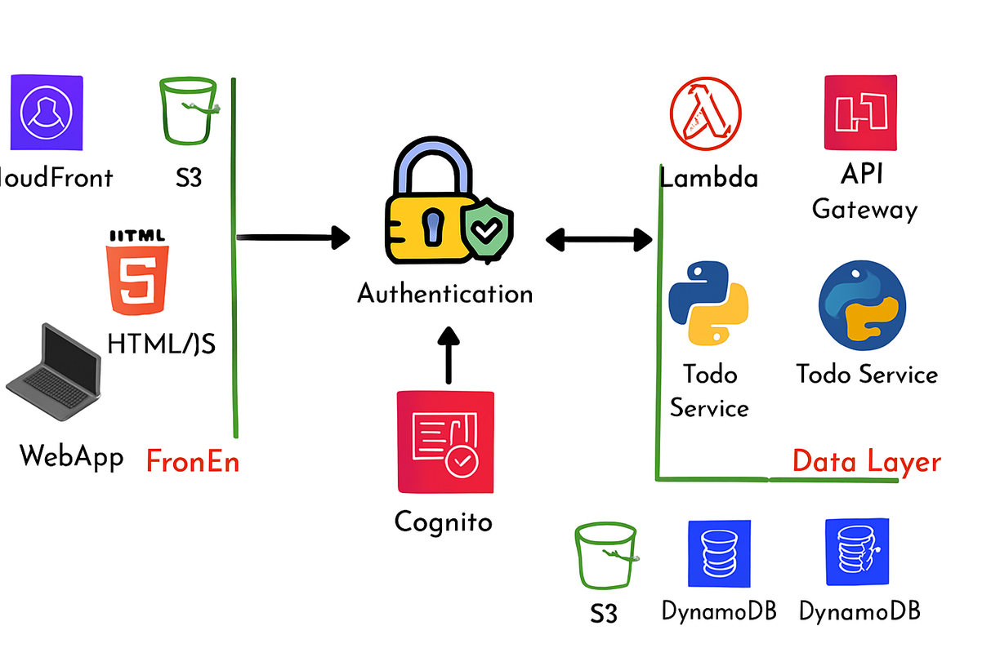

# Serverless To-Do Application on AWS

A serverless to-do application built with **Amazon API Gateway**, **AWS Lambda**, **DynamoDB**, **Cognito**, **S3**, and **CloudFront**.  
This project demonstrates designing a scalable, event-driven serverless architecture with Infrastructure as Code (IaC) using **AWS SAM**.

---

## Author & Purpose

👤 **Author:** Riadh Ibrahim  
🎯 **Purpose:** This project is submitted for review by the **Manara team** in order to be considered for the **AWS Solutions Architect voucher**.

---

## Application Overview

The application allows users to:

- Create, update, complete, and delete to-do items  
- Upload and download files associated with to-dos  
- Authenticate and manage sessions using **Cognito**  
- Interact with the backend through a REST API hosted on **API Gateway**

---

## System Architecture

### Frontend
- Static HTML, CSS, and JavaScript hosted in **Amazon S3**  
- Distributed globally via **Amazon CloudFront** (CDN)

### Backend
- Business logic implemented in **AWS Lambda** functions  
- Exposed through **Amazon API Gateway** REST APIs  
- CORS enabled for frontend integration  

### Data Layer
- **Amazon DynamoDB** stores to-do items and file metadata  
- Schema designed for fast lookups and scalability  

### Authentication
- **Amazon Cognito User Pools** for user registration, login, and token validation  
- API Gateway validates session tokens for secure access  

### File Storage
- Files uploaded to **Amazon S3**  
- Distributed via **CloudFront** for low-latency access  

---

## Application Components

### To-Do Service
Lambda functions:
- `getTodos` – fetch all todos for a user  
- `getTodo` – fetch details of a specific todo  
- `addTodo` – create a new todo  
- `completeTodo` – mark a todo as completed  
- `addTodoNotes` – add or update notes  
- `deleteTodo` – remove a todo  

### Files Service
Lambda functions:
- `getTodoFiles` – fetch files linked to a todo  
- `addTodoFiles` – attach files to a todo  
- `deleteTodoFiles` – remove a file  

---

## Infrastructure as Code (IaC) & Deployment

- Application backend services defined using **AWS SAM templates**  
- Services deployed independently for better decoupling  
- Automated deployments via **GitHub Actions** and pipelines  

**Deployment workflow includes:**
- Separate branches for **development** and **production**  
- CI/CD builds and deploys changes to backend and frontend services  
- Docker-based GitHub Actions runners for repeatable builds  

---

## Key AWS Services Used

- **Amazon API Gateway** – REST API endpoints  
- **AWS Lambda** – serverless compute for backend logic  
- **Amazon DynamoDB** – NoSQL database  
- **Amazon Cognito** – authentication and user management  
- **Amazon S3** – static website hosting + file storage  
- **Amazon CloudFront** – CDN for frontend and file distribution  
- **Amazon CloudWatch** – monitoring and logging  
- **AWS IAM** – roles and permissions for secure access  

---

## Learning Outcomes

- Designing scalable, event-driven **serverless applications**  
- Implementing stateless execution using **API Gateway + Lambda**  
- Applying **DynamoDB best practices** for NoSQL data modeling  
- Securing APIs with **Cognito, IAM, and resource policies**  
- Automating deployment with **SAM + GitHub Actions**  

---

## Disclaimer
This project is for **educational purposes** and serves as a reference architecture for building full-stack serverless applications on AWS.
